# scribe

Select and copy text from anywhere on your screen, the way Google Lens does it. A Quickshell module for Hyprland.

[Website](https://lunanoir21.github.io/scribe/) · [Docs](https://lunanoir21.github.io/scribe/docs.html) · [Türkçe](README.tr.md) · [Changelog](CHANGELOG.md)

Press a key, drag a box around any text (a video, an image, a PDF, a terminal, a locked-down app) and scribe reads it. The text stays exactly where it is on screen. Drag over it to select, then press **Copy** in the small toolbar that appears above the selection.

## Screenshots

Captured on an empty workspace with a clean Firefox profile, reading the Hyprland article on Wikipedia.

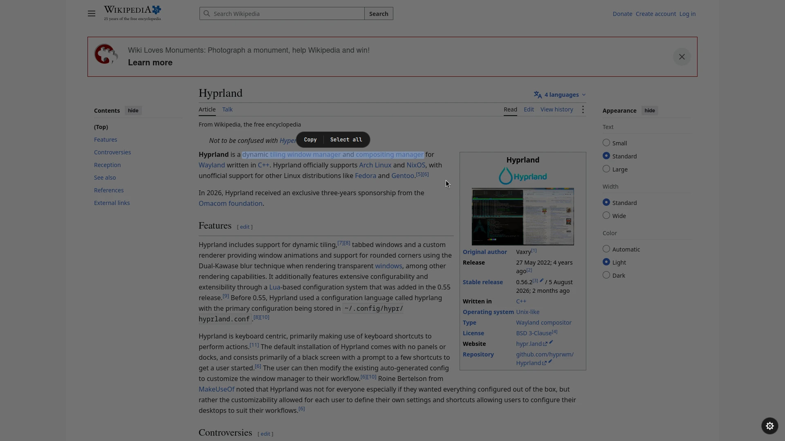

| | |
|---|---|
| 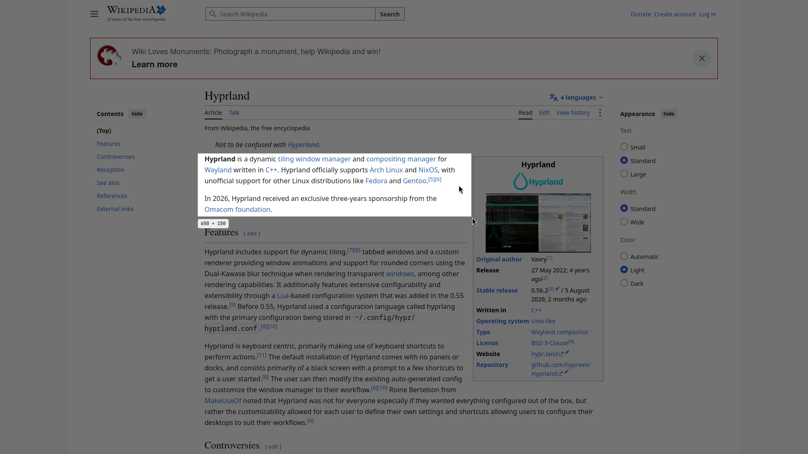 | 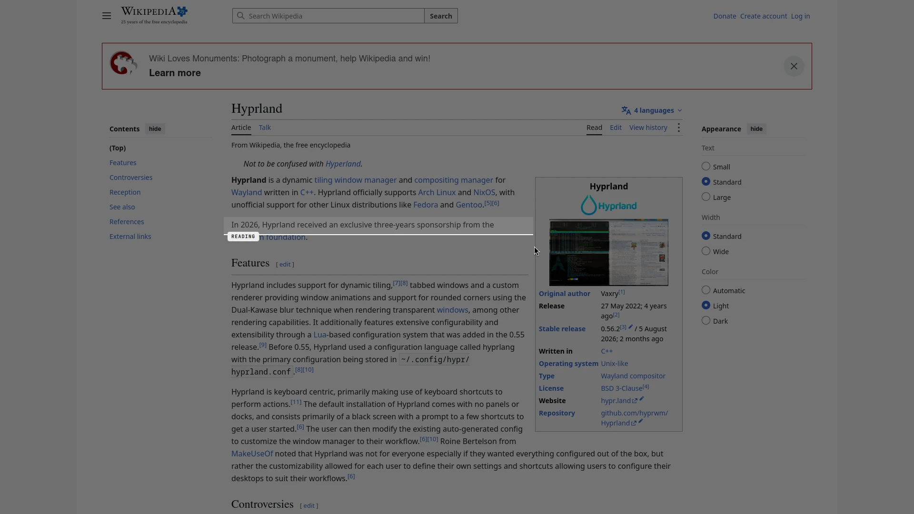 |
| 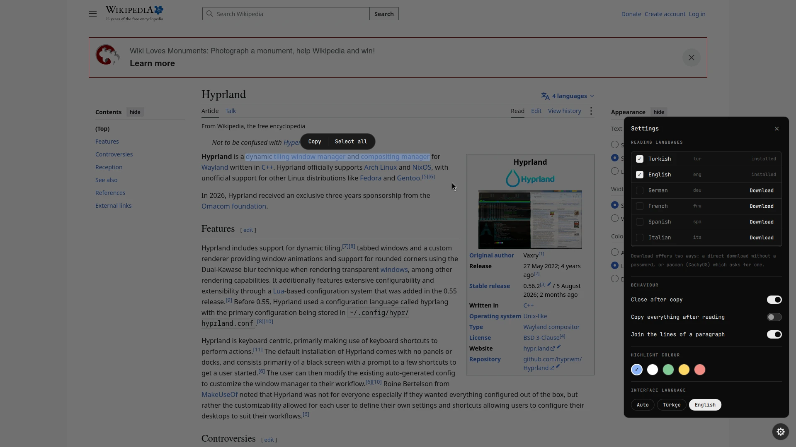 | 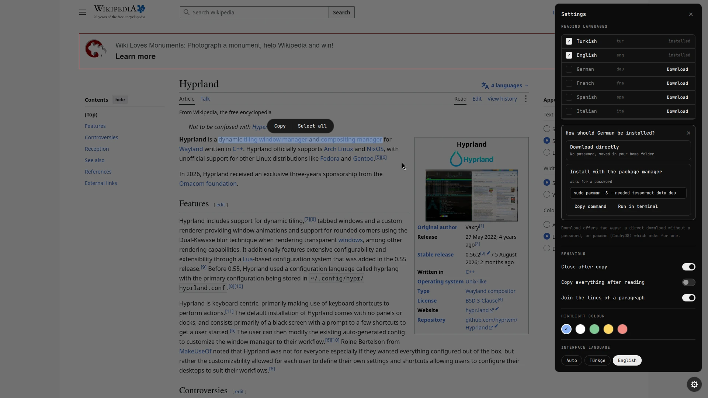 |

## Features

- **Lens-style selection.** Your original text is left untouched. Dragging over words draws a translucent highlight per line, like selecting real text.
- **Fast.** The selection is cut into strips at blank rows and the strips are read by parallel Tesseract processes. A 1000×600 region takes about 0.6 s, a full 1080p screen about 1 s.
- **One window.** Region picker, scanning animation and result all live in a single layer-shell window, so nothing is created or torn down between steps.
- **Language packs from the settings panel.** After a scan, the gear in the bottom-right corner opens settings. For a missing language you choose: download it straight into your home folder (no password), or install it with your distro's package manager (pacman, apt, dnf, apk), which needs a password. The second option shows the exact command, with buttons to copy it or run it in a terminal.
- **Translation, off by default.** Translate what was read in a side-by-side card or right over the text, fix misread words first, hover a word for a dictionary bubble, and turn links, e-mail, phone numbers and IBANs into buttons. Offline (English ↔ Turkish) or online (MyMemory). Switched on from the settings panel, with a warning first. See [Translation](#translation).
- **Keyboard and mouse.** `Ctrl+A` selects everything, `Ctrl+C` or `Enter` copies, `Esc` closes.
- **Quiet UI.** Monochrome, JetBrains Mono, Hyprland's own animation curve. The highlight colour is configurable. English and Turkish interface, switchable in settings.

## Requirements

- Hyprland and [Quickshell](https://quickshell.org)
- `grim`, `wl-clipboard`
- `tesseract` with at least one language pack
- Python 3 with `numpy` and `pillow`
- Only for translation: nothing to install by hand. The offline engine installs itself from the settings panel (needs `python3 -m venv`, about 470 MB). See [Translation](#translation).

## Install

```sh
git clone https://github.com/lunanoir21/scribe
cd scribe
./install.sh --patch
```

`--patch` copies the module to `~/.config/quickshell/vendor/scribe`, adds the import and `ScribeHost {}` to your `Shell.qml`, and appends the key bind to `hyprland.conf`. Edited files are backed up once as `<file>.scribe.bak`, and every edit sits between marker comments. Without `--patch` the script only copies the files and prints the lines to add.

```sh
./install.sh --help
  --dest DIR    folder that will hold scribe/        (default ~/.config/quickshell/vendor)
  --shell FILE  your Quickshell Shell.qml            (default <dest>/../Shell.qml)
  --hypr FILE   your hyprland.conf                   (default ~/.config/hypr/hyprland.conf)
  --key KEYS    bind modifiers and key               (default "SUPER SHIFT, T")
  --uninstall   remove the module and the added lines
```

The bind it adds:

```
bind = SUPER SHIFT, T, exec, qs -p /path/to/Shell.qml ipc call scribe start
```

### Omarchy

On [Omarchy](https://omarchy.org) install it as a shell plugin instead, from the
[scribe-omarchy](https://github.com/lunanoir21/scribe-omarchy) wrapper (a pinned copy of this module):

```sh
omarchy plugin add https://github.com/lunanoir21/scribe-omarchy.git --enable
```

## Use

1. Press `Super+Shift+T`. The screen freezes.
2. Drag a box around the text. A sweeping line shows it is being read.
3. Drag over the words you want. A toolbar appears above the selection: **Copy**, **Select all** and, when translation is on, **Translate**.

| Key | Action |
|---|---|
| `Ctrl+A` | select all text |
| `Ctrl+C` / `Enter` | copy the selection |
| `Esc` | close (closes the settings panel first when it is open) |
| right click | clear the selection |

## Settings

The gear in the bottom-right corner (shown after a scan) opens the panel:

- **Reading languages.** Tick the languages to read with. Languages you do not have show a **Download** button, which offers two ways to install (see below).
- **Behaviour.** Close after copy, copy everything right after reading, join the lines of a paragraph, smart actions.
- **Translation.** The master switch, view, engine, target language, online permission, features and the offline pack. See [Translation](#translation).
- **Highlight colour.**

Everything is stored in `~/.config/scribe/settings.json` (created on first change, mode 600, so upgrades never overwrite it):

| Key | Default | Meaning |
|---|---|---|
| `langs` | `"tur+eng"` | Tesseract language codes joined with `+` |
| `autoCopy` | `false` | copy all text as soon as the read finishes |
| `closeAfterCopy` | `true` | close the overlay shortly after copying |
| `joinLines` | `true` | join the lines of a paragraph with spaces instead of newlines |
| `minConfidence` | `60` | below this average confidence the result is flagged as unsure |
| `highlight` | `"#8ab4f8"` | selection colour |
| `ui` | `"auto"` | interface language: `auto` (follows `$LANG`), `tr` or `en` |
| `translate` | `false` | master switch for everything translation related |
| `autoTranslate` | `false` | translate as soon as the text is read (loads the model then) |
| `tView` | `"card"` | `card` (side by side) or `inplace` (over the text) |
| `tEngine` | `"offline"` | `offline` (English ↔ Turkish) or `online` (MyMemory) |
| `tTarget` / `tSource` | `"tr"` / `"auto"` | target language, source language or `auto` |
| `tOnline` | `false` | standing permission to send text to the online service |
| `tEmail` | `""` | optional MyMemory e-mail, raises the daily quota |
| `smartActions` | `true` | links, e-mail, phone numbers and IBANs as buttons (works without translation) |
| `dictionary` / `editable` | `true` | hover dictionary, editable original |

### Language packs

Pressing **Download** next to a language opens a small card with two options:

1. **Download directly.** Fetches `<code>.traineddata` from `tesseract-ocr/tessdata_fast` into `~/.local/share/scribe/tessdata`. No password, works on any distro.
2. **Install with the package manager.** Needs a password, so scribe does not run it behind your back. It shows the command and gives you **Copy command** and **Run in terminal** (kitty, foot, alacritty, wezterm, konsole, gnome-terminal, xfce4-terminal or xterm, whichever you have; `$TERMINAL` wins). The list refreshes when the terminal closes.

| Distro family | Command shown |
|---|---|
| Arch, CachyOS, Manjaro, EndeavourOS | `sudo pacman -S --needed tesseract-data-<code>` |
| Debian, Ubuntu, Mint, Pop!_OS | `sudo apt-get install -y tesseract-ocr-<code>` |
| Fedora, RHEL, Nobara | `sudo dnf install -y tesseract-langpack-<code>` |
| Alpine | `sudo apk add tesseract-ocr-data-<code>` |

On any other distro only the direct download is offered. Packs in `~/.local/share/scribe/tessdata` win over system ones. The same logic is on the command line: `python3 langs.py info`, `install <code>` (direct download), `command <code>` and `term <code>`.

## Translation

Translation is **off until you switch it on**. While it is off nothing is downloaded, loaded or sent for it, and the Translate button does not exist.

Translating a photo of a printed notice, in both directions (the second photo is Turkish):

| | English → Turkish | Turkish → English |
|---|---|---|
| Card | 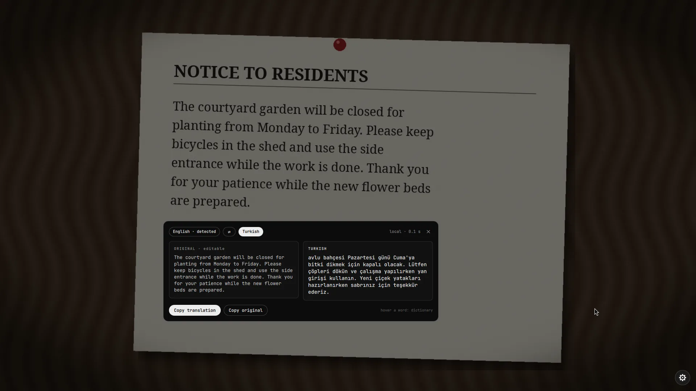 | 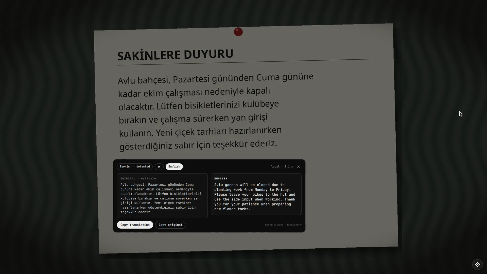 |
| In place | 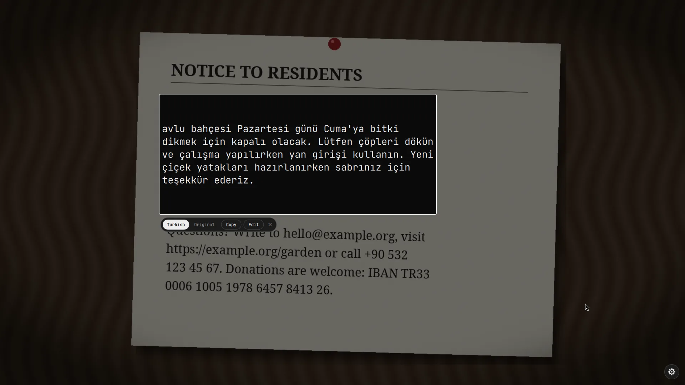 | 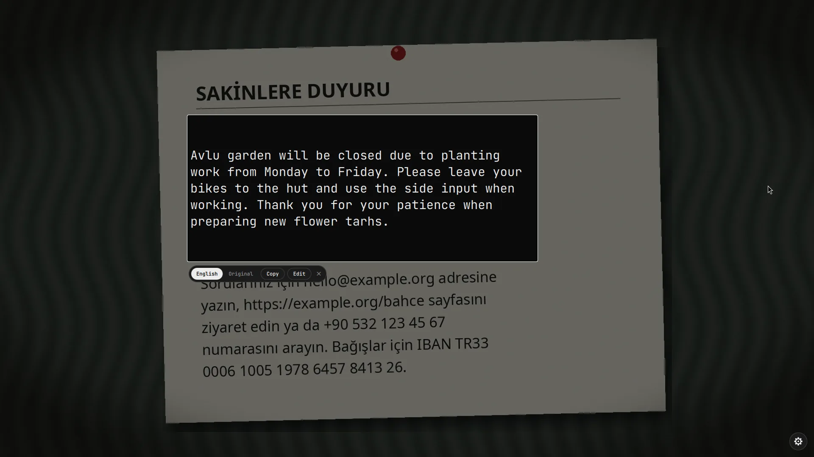 |
| Dictionary | 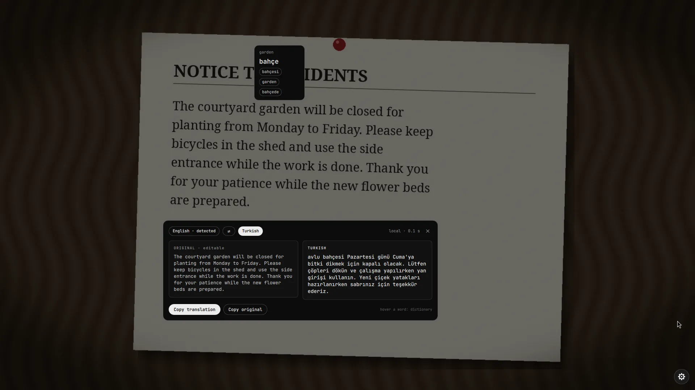 | 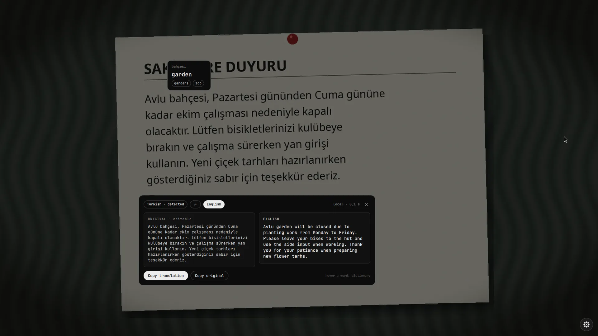 |
| Smart actions | 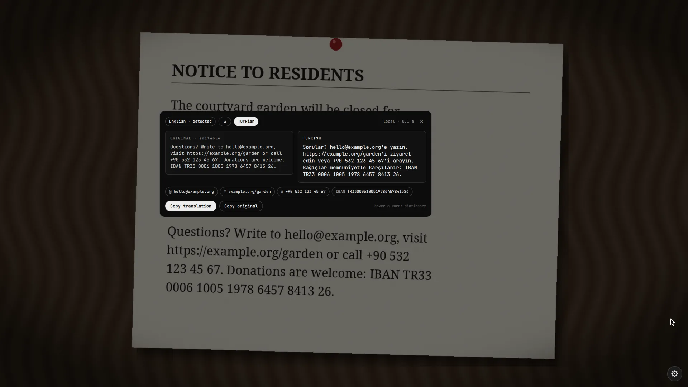 | 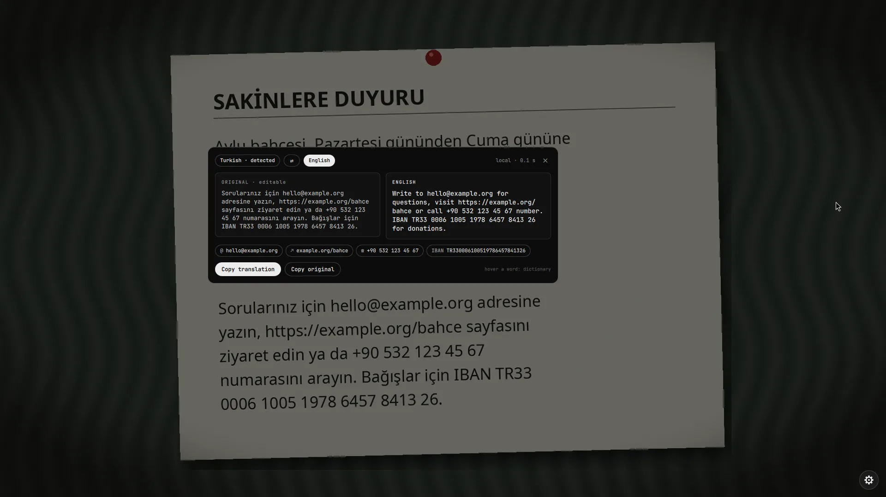 |

The card shown before translation is enabled:

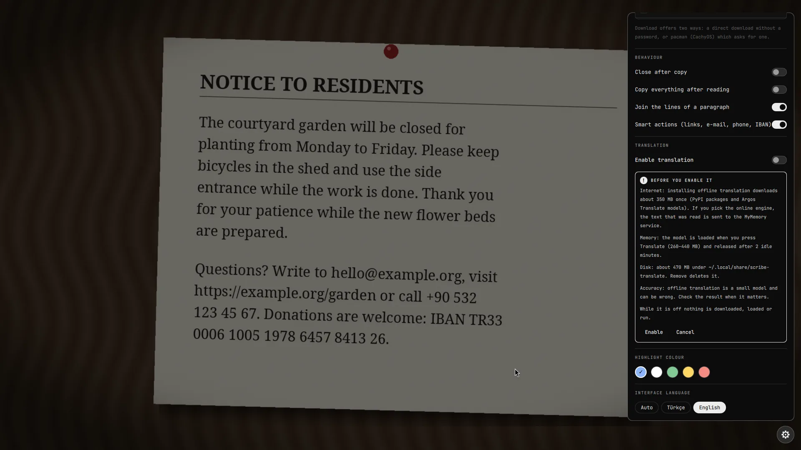

**Switch it on.** Open the gear, find **TRANSLATION** and turn on **Enable translation**. A card first says what it will do: download about 350 MB once for the offline engine, send text to MyMemory only if you pick the online engine, use 260 to 440 MB of memory while a translation is open, and keep about 470 MB on disk. Press **Enable** to confirm.

**Translate.** After a scan, press **Translate** (under the region, or in the selection toolbar to translate only the words you selected). With **Translate right after reading** on in settings it starts by itself.

Two views, picked in settings (**Result view**):

- **Card.** Original and translation side by side. The original is editable, so you can fix a misread word and the translation refreshes about a second later. **Copy translation**, **Copy original** and a swap button for the language direction.
- **In place.** The translation is painted over the text itself, sized to fit the region, with a small bar to switch between the translation and the original, copy, or jump to the card to edit.

**Dictionary.** While a translation is open, hover a word: after a short pause a bubble shows its translation and alternatives. Click the bubble to copy it.

**Smart actions.** Links, e-mail addresses, phone numbers and IBANs found in the text become buttons under the read region: links and e-mail open, phone numbers and IBANs are copied with one click (an IBAN is checked with its mod 97 checksum first), and scribe closes afterwards like it does after **Copy**. This works **without** translation (the **Smart actions** switch is under Behaviour, on by default) because it only runs a small local helper: no model, no network. In a translation they are kept out of the text, so `example.com` never turns into something else.

**Offline translation can be wrong.** It is a small model. It may misread the context, take a word for the subject, or leave a word untranslated: in our own test it turned the Turkish *"Avlu bahçesi … kapalı olacaktır"* into *"Avlu garden will be closed"* ("Avlu", the courtyard, was taken for a name). It is good for the gist and for short passages; check the result when it matters. See [Accuracy](https://lunanoir21.github.io/scribe/docs.html#accuracy) for measured numbers.

**Offline engine (default).** English ↔ Turkish, on your machine. It installs from the settings panel into `~/.local/share/scribe-translate` (an isolated Python environment with pinned packages and SHA-256 verified models, about 470 MB). The model is loaded when you press Translate and released after two idle minutes. Typical times: about 0.15 s once loaded, about 0.4 s for the first translation.

**Online engine.** Any language pair through [MyMemory](https://mymemory.translated.net). The text you translate leaves your computer, so scribe asks first: **Send once**, **Always allow** or **Cancel**. Links, e-mail addresses and IBANs stay local. Anonymous use is limited to about 5,000 characters a day; an optional e-mail in settings raises that to 50,000.

Everything is documented in detail on the [documentation page](https://lunanoir21.github.io/scribe/docs.html).

## How it works

```
key bind ─▶ qs ipc call scribe start
            grim            freeze the focused output
            ScribeLens      drag a region (one full-screen layer window)
            ocr.py          crop, invert dark themes, cut into strips at blank rows,
                            one tesseract process per strip, merge word boxes
            ScribeLens      draw the words where they are, select by dragging
            wl-copy         copy
```

`translate.py` is the translation helper (text on stdin, JSON out); `scribe.sh read` prints one record per word (`W par line x y w h text`, logical pixels) and a final `CONF n`, so the engine can be used on its own.

## Development helpers

These answer only while the file `$XDG_RUNTIME_DIR/scribe-dev` exists (`touch` it first), so they are inert for normal users.

```sh
qs -p Shell.qml ipc call scribe test 340 120 700 260        # read a region, skip the drag
qs -p Shell.qml ipc call scribe testsel 340 120 700 260 3 9 # same, with words 3..9 pre-selected
qs -p Shell.qml ipc call scribe devopen                      # open the settings panel
qs -p Shell.qml ipc call scribe cancel                       # close everything
```

## Limits

- Handwriting and very small text (under about 10 px) are not read reliably.
- **Measured reading accuracy** ([details and method](https://lunanoir21.github.io/scribe/docs.html#accuracy)): on clean text scribe reads 99.6% of the characters correctly in English and 99.9% in Turkish across 11 fonts, 9 colour schemes and 3 sizes (792 runs); on two made-up photos of a printed notice 99.8% (English) and 97.0% (Turkish). Blur, grain, JPEG artefacts and low resolution are fine. **Tilted text is the weak spot**: about 54% of the characters at 3 degrees, and strong uneven light costs about 17%. scribe does not straighten tilted text: select a narrower region, or one line at a time.
- **Offline translation can be wrong**, see [Translation](#translation).
- Reading a whole 1080p screen full of text still takes around a second.

## Security and privacy

scribe takes a screenshot of one monitor, so it is built to leave nothing behind: the screenshot lives in an owner-only runtime directory and is deleted when the overlay closes, and by default nothing is sent anywhere: the only network request is a language pack download you start yourself. Translation is off until you switch it on; with it on, the offline pack is downloaded from PyPI (pinned versions) and argos-net.com (SHA-256 verified) when you press install, and text only leaves your computer if you choose the online engine and agree to it. It never runs a privileged command. See [SECURITY.md](SECURITY.md) for the full list of what it reads, writes and limits.

```sh
python3 -m unittest discover -s tests -v
```

## License

[MIT](LICENSE)
