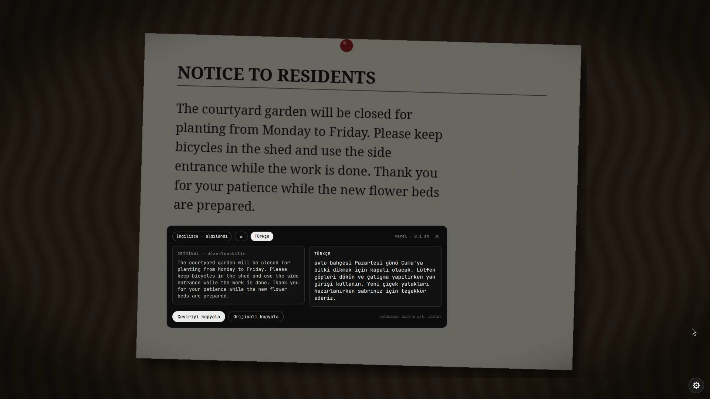
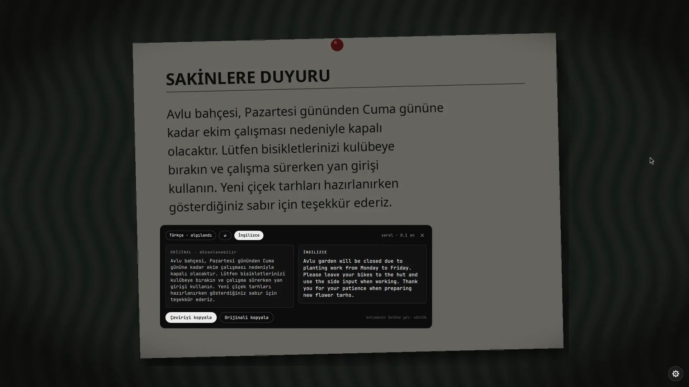
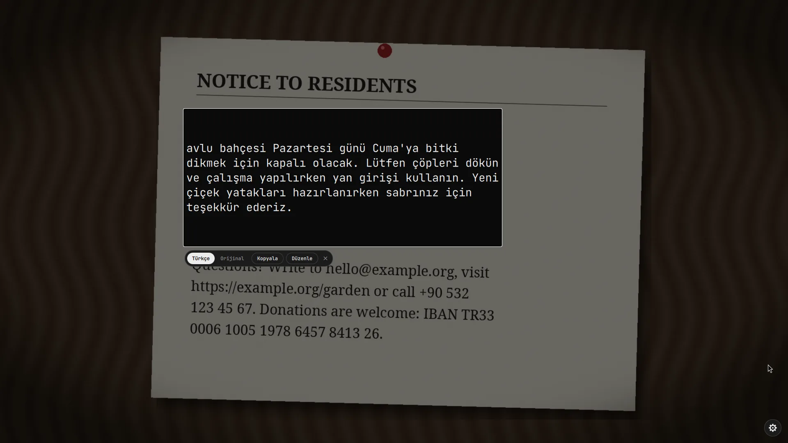
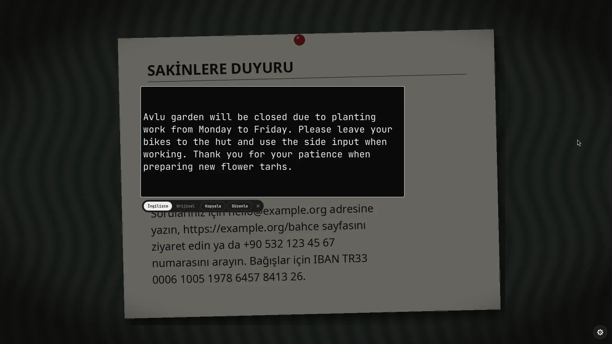
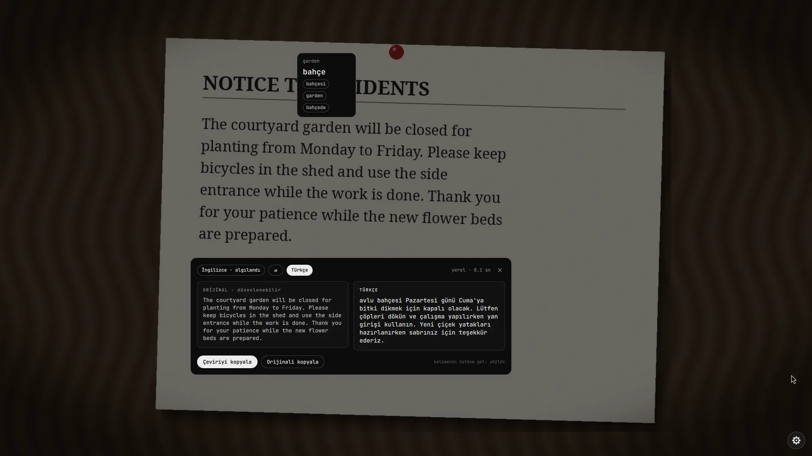
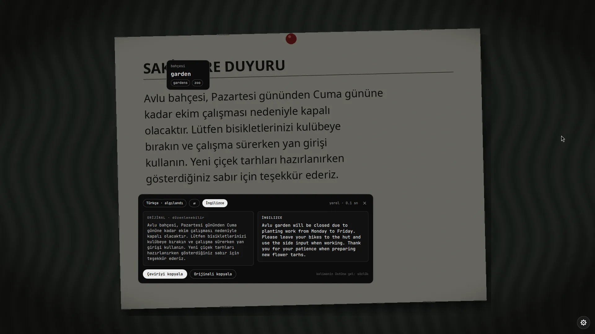
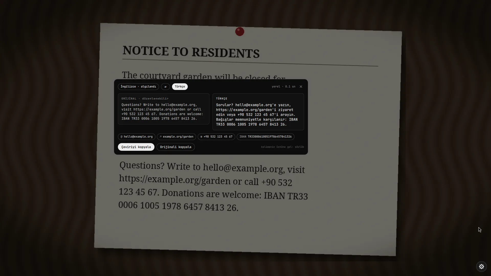
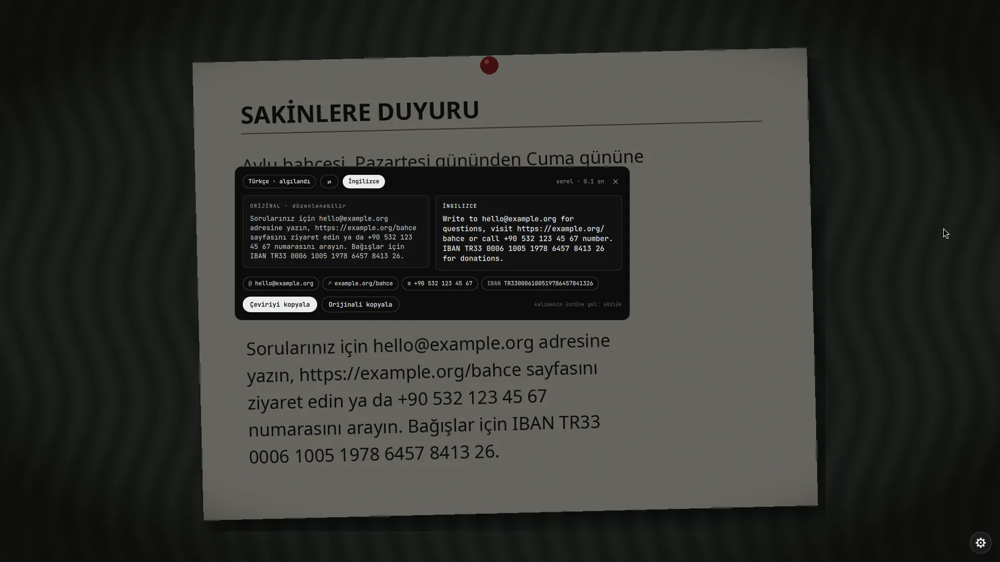
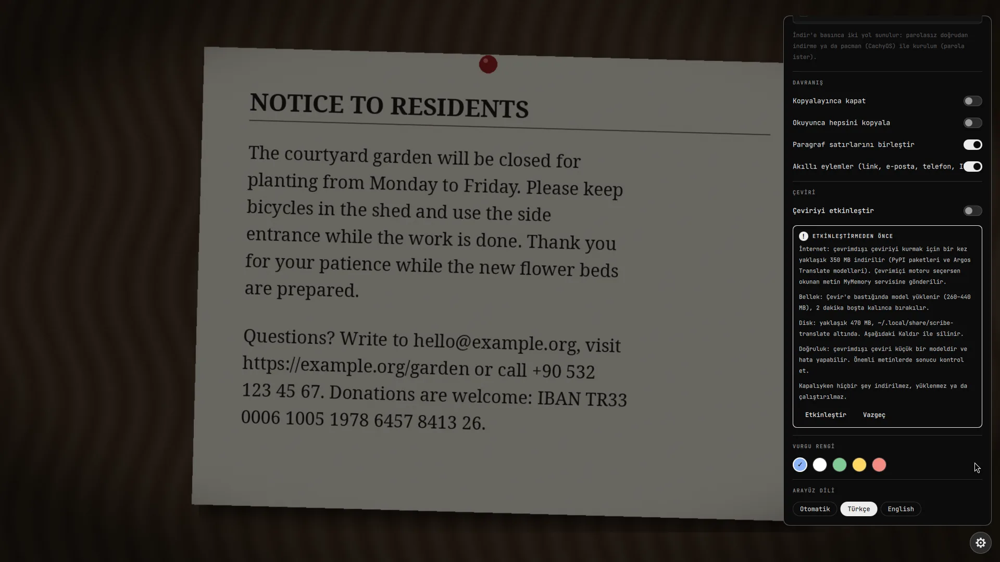

# scribe

Ekranındaki yazıyı Google Lens gibi seç ve kopyala. Hyprland için bir Quickshell modülü.

[Web sitesi](https://lunanoir21.github.io/scribe/) · [Dokümantasyon](https://lunanoir21.github.io/scribe/docs.html) · [English](README.md) · [Değişiklik günlüğü](CHANGELOG.md)

Bir tuşa bas, yazının üstüne bir kutu çiz (video, resim, PDF, terminal, kopyalanamayan bir uygulama) ve scribe okusun. Yazı ekranda olduğu yerde kalır. Üstünden sürükleyerek seç, seçimin üstünde çıkan küçük çubuktan **Kopyala**'ya bas.

## Ekran görüntüleri

Boş bir çalışma alanında, temiz bir Firefox profiliyle Wikipedia'daki Hyprland makalesi okunurken alındı.


| | |
|---|---|
|  |  |
|  |  |

## Özellikler

- **Lens tarzı seçim.** Orijinal yazıya dokunulmaz. Kelimelerin üstünden sürüklemek, gerçek metin seçer gibi satır satır yarı saydam bir vurgu çizer.
- **Hızlı.** Seçim boş satırlardan şeritlere kesilir ve şeritler paralel Tesseract süreçleriyle okunur. 1000×600'lük bir alan yaklaşık 0,6 sn, tam 1080p ekran yaklaşık 1 sn sürer.
- **Tek pencere.** Alan seçimi, tarama animasyonu ve sonuç tek bir layer-shell penceresinde, adımlar arasında hiçbir şey yeniden yaratılmaz.
- **Ayarlardan dil paketi.** Taramadan sonra sağ alttaki dişli ayarları açar. Eksik bir dil için seçersin: doğrudan ev klasörüne indir (parola yok) ya da dağıtımının paket yöneticisiyle (pacman, apt, dnf, apk) kur, ki bu parola ister. İkinci seçenek tam komutu gösterir, kopyalama ve terminalde çalıştırma düğmeleri vardır.
- **Çeviri, varsayılan olarak kapalı.** Okunanı yan yana bir kartta ya da doğrudan yazının üstünde çevir, yanlış okunan kelimeleri önce düzelt, bir kelimenin üstüne gelince sözlük balonu gör, bağlantıları, e-postaları, telefonları ve IBAN'ları düğmeye çevir. Çevrimdışı (İngilizce ↔ Türkçe) ya da çevrimiçi (MyMemory). Ayar panelinden, önce bir uyarıyla açılır. Bkz. [Çeviri](#çeviri).
- **Klavye ve fare.** `Ctrl+A` hepsini seçer, `Ctrl+C` ya da `Enter` kopyalar, `Esc` kapatır.
- **Sakin arayüz.** Monokrom, JetBrains Mono, Hyprland'ın kendi animasyon eğrisi. Vurgu rengi ayarlanabilir. Türkçe ve İngilizce arayüz, ayarlardan değiştirilir.

## Gereksinimler

- Hyprland ve [Quickshell](https://quickshell.org)
- `grim`, `wl-clipboard`
- En az bir dil paketiyle `tesseract`
- `numpy` ve `pillow` ile Python 3
- Yalnızca çeviri için: elle kurulacak bir şey yok. Çevrimdışı motor ayar panelinden kendini kurar (`python3 -m venv` gerekir, yaklaşık 470 MB). Bkz. [Çeviri](#çeviri).

## Kurulum

```sh
git clone https://github.com/lunanoir21/scribe
cd scribe
./install.sh --patch
```

`--patch` modülü `~/.config/quickshell/vendor/scribe` içine kopyalar, `Shell.qml` dosyana import ve `ScribeHost {}` ekler, `hyprland.conf` sonuna kısayolu yazar. Düzenlenen dosyaların bir kez `<dosya>.scribe.bak` yedeği alınır ve her değişiklik işaret yorumlarının arasındadır. `--patch` olmadan betik yalnızca dosyaları kopyalar ve eklemen gereken satırları yazdırır.

```sh
./install.sh --help
  --dest DIR    scribe/ klasörünün konacağı yer     (varsayılan ~/.config/quickshell/vendor)
  --shell FILE  Quickshell Shell.qml dosyan         (varsayılan <dest>/../Shell.qml)
  --hypr FILE   hyprland.conf dosyan                (varsayılan ~/.config/hypr/hyprland.conf)
  --key KEYS    kısayol tuşları                     (varsayılan "SUPER SHIFT, T")
  --uninstall   modülü ve eklenen satırları kaldır
```

Eklenen kısayol:

```
bind = SUPER SHIFT, T, exec, qs -p /path/to/Shell.qml ipc call scribe start
```

### Omarchy

[Omarchy](https://omarchy.org)'de bunun yerine kabuk eklentisi olarak kur: [scribe-omarchy](https://github.com/lunanoir21/scribe-omarchy) bu modülün sabitlenmiş bir kopyasını taşıyan sarmalayıcıdır.

```sh
omarchy plugin add https://github.com/lunanoir21/scribe-omarchy.git --enable
```

## Kullanım

1. `Super+Shift+T`'ye bas. Ekran donar.
2. Yazının üstüne bir kutu çiz. Süpürme çizgisi okunduğunu gösterir.
3. İstediğin kelimelerin üstünden sürükle. Seçimin üstünde bir çubuk çıkar: **Kopyala**, **Tümünü seç** ve çeviri açıksa **Çevir**.

| Tuş | İşlem |
|---|---|
| `Ctrl+A` | tüm yazıyı seç |
| `Ctrl+C` / `Enter` | seçimi kopyala |
| `Esc` | kapat (ayar paneli açıksa önce onu kapatır) |
| sağ tık | seçimi temizle |

## Ayarlar

Taramadan sonra sağ alttaki dişli paneli açar:

- **Okuma dilleri.** Okumak istediğin dilleri işaretle. Kurulu olmayan dillerde **İndir** düğmesi çıkar, iki kurulum yolu sunar (aşağıya bak).
- **Davranış.** Kopyalayınca kapat, okuyunca hepsini kopyala, paragraf satırlarını birleştir, akıllı eylemler.
- **Çeviri.** Ana anahtar, görünüm, motor, hedef dil, çevrimiçi izin, özellikler ve çevrimdışı paket. Bkz. [Çeviri](#çeviri).
- **Vurgu rengi.**

Her şey `~/.config/scribe/settings.json` dosyasında saklanır (ilk değişiklikte oluşur, mod 600, yani güncellemeler üzerine yazmaz):

| Anahtar | Varsayılan | Anlamı |
|---|---|---|
| `langs` | `"tur+eng"` | `+` ile birleştirilmiş Tesseract dil kodları |
| `autoCopy` | `false` | okuma bitince tüm yazıyı kopyala |
| `closeAfterCopy` | `true` | kopyalamadan kısa süre sonra kapat |
| `joinLines` | `true` | paragraf satırlarını yeni satır yerine boşlukla birleştir |
| `minConfidence` | `60` | ortalama güven bunun altındaysa sonuç "emin değil" diye işaretlenir |
| `highlight` | `"#8ab4f8"` | seçim rengi |
| `scanAnim` | `"line"` | okurken gösterilen animasyon: `line`, `rows`, `shine`, `pixels`, `ring` veya `focus` |
| `ui` | `"auto"` | arayüz dili: `auto` (`$LANG`'i izler), `tr` ya da `en` |
| `translate` | `false` | çeviriyle ilgili her şeyin ana anahtarı |
| `autoTranslate` | `false` | yazı okunur okunmaz çevir (modeli o zaman yükler) |
| `tView` | `"card"` | `card` (yan yana) ya da `inplace` (yazının üstünde) |
| `tEngine` | `"offline"` | `offline` (İngilizce ↔ Türkçe) ya da `online` (MyMemory) |
| `tTarget` / `tSource` | `"tr"` / `"auto"` | hedef dil, kaynak dil ya da `auto` |
| `tOnline` | `false` | metni çevrimiçi servise göndermek için kalıcı izin |
| `tEmail` | `""` | isteğe bağlı MyMemory e-postası, günlük kotayı artırır |
| `smartActions` | `true` | bağlantı, e-posta, telefon ve IBAN düğmeleri (çeviri olmadan da çalışır) |
| `dictionary` / `editable` | `true` | sözlük, düzenlenebilir orijinal |

### Dil paketleri

Bir dilin yanındaki **İndir**'e basınca iki seçenekli küçük bir kart açılır:

1. **Doğrudan indir.** `tesseract-ocr/tessdata_fast` içinden `<kod>.traineddata` dosyasını `~/.local/share/scribe/tessdata` içine indirir. Parola yok, her dağıtımda çalışır.
2. **Paket yöneticisiyle kur.** Parola ister, bu yüzden scribe bunu arkandan çalıştırmaz. Komutu gösterir ve **Komutu kopyala** ile **Terminalde çalıştır** düğmelerini verir (kitty, foot, alacritty, wezterm, konsole, gnome-terminal, xfce4-terminal ya da xterm, hangisi varsa; `$TERMINAL` önceliklidir). Terminal kapanınca liste yenilenir.

| Dağıtım ailesi | Gösterilen komut |
|---|---|
| Arch, CachyOS, Manjaro, EndeavourOS | `sudo pacman -S --needed tesseract-data-<kod>` |
| Debian, Ubuntu, Mint, Pop!_OS | `sudo apt-get install -y tesseract-ocr-<kod>` |
| Fedora, RHEL, Nobara | `sudo dnf install -y tesseract-langpack-<kod>` |
| Alpine | `sudo apk add tesseract-ocr-data-<kod>` |

Başka bir dağıtımda yalnızca doğrudan indirme sunulur. `~/.local/share/scribe/tessdata` içindeki paketler sistemdekilerden önceliklidir. Aynı mantık komut satırında da var: `python3 langs.py info`, `install <kod>` (doğrudan indirme), `command <kod>` ve `term <kod>`.

## Çeviri

Çeviri, **sen açana kadar kapalıdır**. Kapalıyken çeviri için hiçbir şey indirilmez, yüklenmez ya da gönderilmez ve Çevir düğmesi yoktur.

Basılı bir duyurunun fotoğrafını iki yönde çevirmek (ikinci fotoğraf Türkçe):

| | İngilizce → Türkçe | Türkçe → İngilizce |
|---|---|---|
| Kart |  |  |
| Yerinde |  |  |
| Sözlük |  |  |
| Akıllı eylemler |  |  |

Çeviri etkinleştirilmeden önce çıkan kart:



**Aç.** Dişliyi aç, **ÇEVİRİ** bölümünde **Çeviriyi etkinleştir**'i aç. Önce bir kart neler yapacağını söyler: çevrimdışı motor için bir kez yaklaşık 350 MB indirir, çevrimiçi motoru seçmezsen metin hiçbir yere gönderilmez, çeviri açıkken 260 ile 440 MB bellek kullanır, diskte yaklaşık 470 MB yer tutar. Onaylamak için **Etkinleştir**'e bas.

**Çevir.** Taramadan sonra **Çevir**'e bas (alanın altında, ya da yalnızca seçtiğin kelimeleri çevirmek için seçim çubuğunda). Ayarlarda **Okuyunca hemen çevir** açıksa kendiliğinden başlar.

İki görünüm var, ayarlardan seçilir (**Sonuç görünümü**):

- **Kart.** Orijinal ve çeviri yan yana. Orijinal düzenlenebilir: yanlış okunan bir kelimeyi düzeltirsen çeviri yaklaşık bir saniye sonra yenilenir. **Çeviriyi kopyala**, **Orijinali kopyala** ve dil yönünü değiştiren bir düğme var.
- **Yerinde.** Çeviri, alana sığacak boyutta, yazının üstüne çizilir. Çeviri ile orijinal arasında geçiş, kopyalama ya da düzenlemek için karta geçme düğmeleri olan küçük bir çubuk bulunur.

**Sözlük.** Çeviri açıkken bir kelimenin üstüne gel: kısa bir bekleyişten sonra çevirisini ve alternatiflerini gösteren bir balon çıkar. Balona tıklarsan kopyalanır.

**Akıllı eylemler.** Okunan alanın altında, metinde bulunan bağlantılar, e-posta adresleri, telefon numaraları ve IBAN'lar düğme olur: bağlantı ve e-posta açılır, telefon ve IBAN tek tıkla kopyalanır (IBAN önce mod 97 sağlamasından geçer) ve ardından scribe, **Kopyala**'dan sonra olduğu gibi kapanır. Bu, çeviri **olmadan** da çalışır (**Akıllı eylemler** anahtarı Davranış altında, varsayılan olarak açık) çünkü yalnızca küçük, yerel bir yardımcı çalıştırır: model yok, ağ yok. Çeviride bunlar metnin dışında tutulur, yani `example.com` başka bir şeye dönüşmez.

**Çevrimdışı çeviri hata yapabilir.** Küçük bir modeldir. Bağlamı yanlış anlayabilir, bir kelimeyi özne sanabilir ya da çevirmeden bırakabilir: kendi denememizde Türkçe *"Avlu bahçesi … kapalı olacaktır"* cümlesini *"Avlu garden will be closed"* yaptı ("Avlu", yani courtyard, bir isim sanıldı). Ana fikir ve kısa parçalar için iyidir; önemli olduğunda sonucu kontrol et. Ölçülen sayılar için [Doğruluk](https://lunanoir21.github.io/scribe/docs.html#accuracy) bölümüne bak.

**Çevrimdışı motor (varsayılan).** İngilizce ↔ Türkçe, kendi makinende. Ayar panelinden, `~/.local/share/scribe-translate` altına kurulur (sürümleri sabitlenmiş paketlerle izole bir Python ortamı ve SHA-256 ile doğrulanan modeller, yaklaşık 470 MB). Model Çevir'e basınca yüklenir, iki dakika boşta kalınca bırakılır. Tipik süre: yüklüyken yaklaşık 0,15 sn, ilk çeviri yaklaşık 0,4 sn.

**Çevrimiçi motor.** [MyMemory](https://mymemory.translated.net) üzerinden her dil çifti. Çevirdiğin metin bilgisayarından çıkar, bu yüzden scribe önce sorar: **Bir kez gönder**, **Her zaman izin ver** ya da **Vazgeç**. Bağlantılar, e-posta adresleri ve IBAN'lar yerelde kalır. Anonim kullanım günde yaklaşık 5.000 karakterle sınırlı, ayarlardaki isteğe bağlı e-posta bunu 50.000'e çıkarır.

Her şey [dokümantasyon sayfasında](https://lunanoir21.github.io/scribe/docs.html) ayrıntılı anlatılıyor.

## Nasıl çalışır

```
kısayol ─▶ qs ipc call scribe start
           grim            odaktaki ekranı dondur
           ScribeLens      alan seç (tek tam ekran layer penceresi)
           ocr.py          kırp, koyu temayı ters çevir, boş satırlardan şeritlere kes,
                           şerit başına bir tesseract süreci, kelime kutularını birleştir
           ScribeLens      kelimeleri yerinde çiz, sürükleyerek seç
           wl-copy         kopyala
```

`scribe.sh read` kelime başına bir kayıt (`W par line x y w h text`, mantıksal piksel) ve son satırda `CONF n` yazdırır, yani motor tek başına da kullanılabilir.

## Geliştirici yardımcıları

Bunlar yalnızca `$XDG_RUNTIME_DIR/scribe-dev` dosyası varken yanıt verir (önce `touch` ile oluştur), yani normal kullanıcı için etkisizdir.

```sh
qs -p Shell.qml ipc call scribe test 340 120 700 260        # sürüklemeyi atla, bölgeyi oku
qs -p Shell.qml ipc call scribe testsel 340 120 700 260 3 9 # aynısı, 3..9. kelimeler seçili
qs -p Shell.qml ipc call scribe devopen                      # ayar panelini aç
qs -p Shell.qml ipc call scribe cancel                       # her şeyi kapat
```

## Sınırlar

- El yazısı ve çok küçük (yaklaşık 10 px altı) yazılar güvenilir okunmaz.
- **Ölçülmüş okuma doğruluğu** ([ayrıntılar ve yöntem](https://lunanoir21.github.io/scribe/docs.html#accuracy)): temiz yazıda scribe, 11 yazı tipi, 9 renk düzeni ve 3 boyutta (792 çalışma) karakterlerin İngilizcede %99.6, Türkçede %99.9 kadarını doğru okur; basılı bir duyurunun iki uydurma fotoğrafında %99.8 (İngilizce) ve %97.0 (Türkçe). Bulanıklık, gren, JPEG bozulması ve düşük çözünürlük sorun değil. **Zayıf nokta eğik yazı**: 3 derecede karakterlerin yaklaşık %54'ü, güçlü eşitsiz ışık ise yaklaşık %17 kaybettirir. scribe eğik yazıyı düzeltmez: daha dar bir alan ya da tek bir satır seç.
- **Çevrimdışı çeviri hata yapabilir**, bkz. [Çeviri](#çeviri).
- Yazı dolu bir 1080p ekranın tamamını okumak hâlâ yaklaşık bir saniye sürer.

## Güvenlik ve gizlilik

scribe bir ekranın görüntüsünü alır, bu yüzden arkasında iz bırakmayacak şekilde yazıldı: görüntü yalnızca sahibine açık bir çalışma dizininde durur ve katman kapanınca silinir, varsayılan olarak hiçbir şey hiçbir yere gönderilmez: tek ağ isteği senin başlattığın dil paketi indirmesidir. Çeviri sen açana kadar kapalıdır; açıkken çevrimdışı paket, kur'a bastığında PyPI'den (sürümler sabit) ve argos-net.com'dan (SHA-256 doğrulamalı) indirilir, metin ise yalnızca çevrimiçi motoru seçip buna izin verirsen bilgisayarından çıkar. Hiçbir zaman yetkili bir komut çalıştırmaz. Neyi okuyup yazdığının ve sınırlarının tam listesi için [SECURITY.md](SECURITY.md) dosyasına bak.

```sh
python3 -m unittest discover -s tests -v
```

## Lisans

[MIT](LICENSE)
