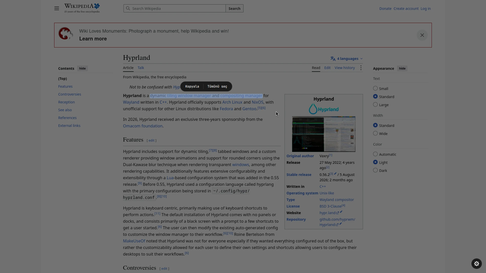
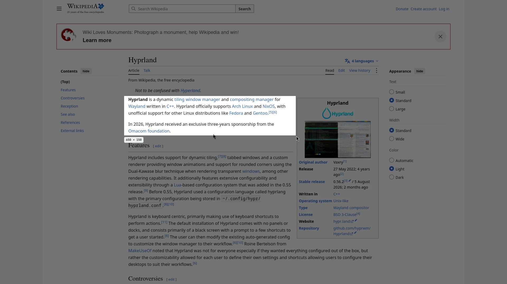
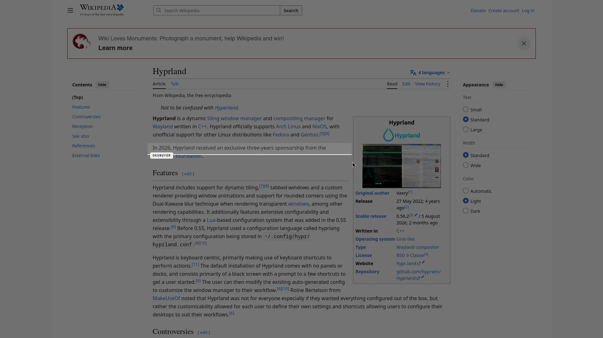
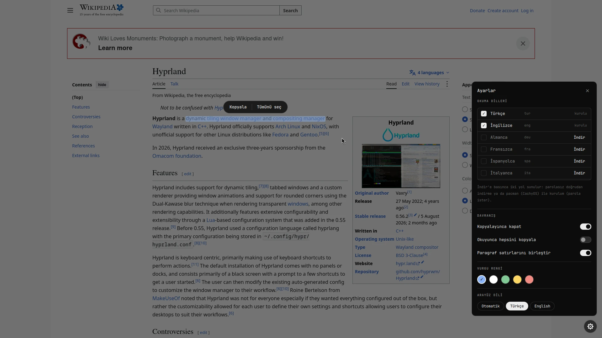
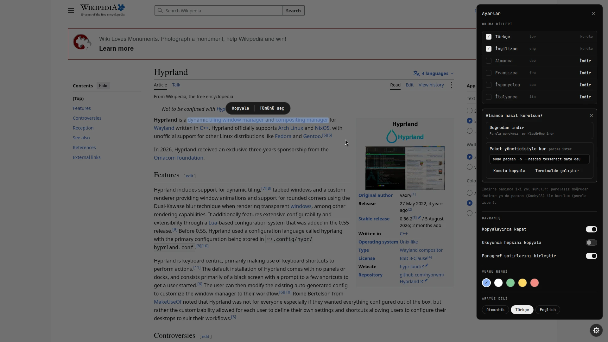

# scribe

Ekranındaki yazıyı Google Lens gibi seç ve kopyala. Hyprland için bir Quickshell modülü.

[Web sitesi](https://lunanoir21.github.io/scribe/) · [English](README.md) · [Değişiklik günlüğü](CHANGELOG.md)

Bir tuşa bas, yazının üstüne bir kutu çiz (video, resim, PDF, terminal, kopyalanamayan bir uygulama) ve scribe okusun. Yazı ekranda olduğu yerde kalır. Üstünden sürükleyerek seç, seçimin üstünde çıkan küçük çubuktan **Kopyala**'ya bas.

## Ekran görüntüleri

Boş bir çalışma alanında, temiz bir Firefox profiliyle Wikipedia'daki Hyprland makalesi okunurken alındı.



| | |
|---|---|
|  |  |
|  |  |

## Özellikler

- **Lens tarzı seçim.** Orijinal yazıya dokunulmaz. Kelimelerin üstünden sürüklemek, gerçek metin seçer gibi satır satır yarı saydam bir vurgu çizer.
- **Hızlı.** Seçim boş satırlardan şeritlere kesilir ve şeritler paralel Tesseract süreçleriyle okunur. 1000×600'lük bir alan yaklaşık 0,6 sn, tam 1080p ekran yaklaşık 1 sn sürer.
- **Tek pencere.** Alan seçimi, tarama animasyonu ve sonuç tek bir layer-shell penceresinde, adımlar arasında hiçbir şey yeniden yaratılmaz.
- **Ayarlardan dil paketi.** Taramadan sonra sağ alttaki dişli ayarları açar. Eksik bir dil için seçersin: doğrudan ev klasörüne indir (parola yok) ya da dağıtımının paket yöneticisiyle (pacman, apt, dnf, apk) kur, ki bu parola ister. İkinci seçenek tam komutu gösterir, kopyalama ve terminalde çalıştırma düğmeleri vardır.
- **Klavye ve fare.** `Ctrl+A` hepsini seçer, `Ctrl+C` ya da `Enter` kopyalar, `Esc` kapatır.
- **Sakin arayüz.** Monokrom, JetBrains Mono, Hyprland'ın kendi animasyon eğrisi. Vurgu rengi ayarlanabilir. Türkçe ve İngilizce arayüz, ayarlardan değiştirilir.

## Gereksinimler

- Hyprland ve [Quickshell](https://quickshell.org)
- `grim`, `wl-clipboard`
- En az bir dil paketiyle `tesseract`
- `numpy` ve `pillow` ile Python 3

## Kurulum

```sh
git clone https://github.com/lunanoir21/scribe
cd scribe
./install.sh --patch
```

`--patch` modülü `~/.config/quickshell/vendor/scribe` içine kopyalar, `Shell.qml` dosyana import ve `ScribeHost {}` ekler, `hyprland.conf` sonuna kısayolu yazar. Düzenlenen dosyaların bir kez `<dosya>.scribe.bak` yedeği alınır ve her değişiklik işaret yorumlarının arasındadır. `--patch` olmadan betik yalnızca dosyaları kopyalar ve eklemen gereken satırları yazdırır.

```sh
./install.sh --help
  --dest DIR    scribe/ klasörünün konacağı yer     (varsayılan ~/.config/quickshell/vendor)
  --shell FILE  Quickshell Shell.qml dosyan         (varsayılan <dest>/../Shell.qml)
  --hypr FILE   hyprland.conf dosyan                (varsayılan ~/.config/hypr/hyprland.conf)
  --key KEYS    kısayol tuşları                     (varsayılan "SUPER SHIFT, T")
  --uninstall   modülü ve eklenen satırları kaldır
```

Eklenen kısayol:

```
bind = SUPER SHIFT, T, exec, qs -p /path/to/Shell.qml ipc call scribe start
```

## Kullanım

1. `Super+Shift+T`'ye bas. Ekran donar.
2. Yazının üstüne bir kutu çiz. Süpürme çizgisi okunduğunu gösterir.
3. İstediğin kelimelerin üstünden sürükle. Seçimin üstünde bir çubuk çıkar: **Kopyala** ya da **Tümünü seç**.

| Tuş | İşlem |
|---|---|
| `Ctrl+A` | tüm yazıyı seç |
| `Ctrl+C` / `Enter` | seçimi kopyala |
| `Esc` | kapat (ayar paneli açıksa önce onu kapatır) |
| sağ tık | seçimi temizle |

## Ayarlar

Taramadan sonra sağ alttaki dişli paneli açar:

- **Okuma dilleri.** Okumak istediğin dilleri işaretle. Kurulu olmayan dillerde **İndir** düğmesi çıkar, iki kurulum yolu sunar (aşağıya bak).
- **Davranış.** Kopyalayınca kapat, okuyunca hepsini kopyala, paragraf satırlarını birleştir.
- **Vurgu rengi.**

Her şey `~/.config/scribe/settings.json` dosyasında saklanır (ilk değişiklikte oluşur, mod 600, yani güncellemeler üzerine yazmaz):

| Anahtar | Varsayılan | Anlamı |
|---|---|---|
| `langs` | `"tur+eng"` | `+` ile birleştirilmiş Tesseract dil kodları |
| `autoCopy` | `false` | okuma bitince tüm yazıyı kopyala |
| `closeAfterCopy` | `true` | kopyalamadan kısa süre sonra kapat |
| `joinLines` | `true` | paragraf satırlarını yeni satır yerine boşlukla birleştir |
| `minConfidence` | `60` | ortalama güven bunun altındaysa sonuç "emin değil" diye işaretlenir |
| `highlight` | `"#8ab4f8"` | seçim rengi |
| `ui` | `"auto"` | arayüz dili: `auto` (`$LANG`'i izler), `tr` ya da `en` |

### Dil paketleri

Bir dilin yanındaki **İndir**'e basınca iki seçenekli küçük bir kart açılır:

1. **Doğrudan indir.** `tesseract-ocr/tessdata_fast` içinden `<kod>.traineddata` dosyasını `~/.local/share/scribe/tessdata` içine indirir. Parola yok, her dağıtımda çalışır.
2. **Paket yöneticisiyle kur.** Parola ister, bu yüzden scribe bunu arkandan çalıştırmaz. Komutu gösterir ve **Komutu kopyala** ile **Terminalde çalıştır** düğmelerini verir (kitty, foot, alacritty, wezterm, konsole, gnome-terminal, xfce4-terminal ya da xterm, hangisi varsa; `$TERMINAL` önceliklidir). Terminal kapanınca liste yenilenir.

| Dağıtım ailesi | Gösterilen komut |
|---|---|
| Arch, CachyOS, Manjaro, EndeavourOS | `sudo pacman -S --needed tesseract-data-<kod>` |
| Debian, Ubuntu, Mint, Pop!_OS | `sudo apt-get install -y tesseract-ocr-<kod>` |
| Fedora, RHEL, Nobara | `sudo dnf install -y tesseract-langpack-<kod>` |
| Alpine | `sudo apk add tesseract-ocr-data-<kod>` |

Başka bir dağıtımda yalnızca doğrudan indirme sunulur. `~/.local/share/scribe/tessdata` içindeki paketler sistemdekilerden önceliklidir. Aynı mantık komut satırında da var: `python3 langs.py info`, `install <kod>` (doğrudan indirme), `command <kod>` ve `term <kod>`.

## Nasıl çalışır

```
kısayol ─▶ qs ipc call scribe start
           grim            odaktaki ekranı dondur
           ScribeLens      alan seç (tek tam ekran layer penceresi)
           ocr.py          kırp, koyu temayı ters çevir, boş satırlardan şeritlere kes,
                           şerit başına bir tesseract süreci, kelime kutularını birleştir
           ScribeLens      kelimeleri yerinde çiz, sürükleyerek seç
           wl-copy         kopyala
```

`scribe.sh read` kelime başına bir kayıt (`W par line x y w h text`, mantıksal piksel) ve son satırda `CONF n` yazdırır, yani motor tek başına da kullanılabilir.

## Geliştirici yardımcıları

Bunlar yalnızca `$XDG_RUNTIME_DIR/scribe-dev` dosyası varken yanıt verir (önce `touch` ile oluştur), yani normal kullanıcı için etkisizdir.

```sh
qs -p Shell.qml ipc call scribe test 340 120 700 260        # sürüklemeyi atla, bölgeyi oku
qs -p Shell.qml ipc call scribe testsel 340 120 700 260 3 9 # aynısı, 3..9. kelimeler seçili
qs -p Shell.qml ipc call scribe devopen                      # ayar panelini aç
qs -p Shell.qml ipc call scribe cancel                       # her şeyi kapat
```

## Sınırlar

- El yazısı ve çok küçük (yaklaşık 10 px altı) yazılar güvenilir okunmaz.
- Yazı dolu bir 1080p ekranın tamamını okumak hâlâ yaklaşık bir saniye sürer.

## Güvenlik ve gizlilik

scribe bir ekranın görüntüsünü alır, bu yüzden arkasında iz bırakmayacak şekilde yazıldı: görüntü yalnızca sahibine açık bir çalışma dizininde durur ve katman kapanınca silinir, hiçbir şey hiçbir yere gönderilmez, tek ağ isteği senin başlattığın dil paketi indirmesidir. Hiçbir zaman yetkili bir komut çalıştırmaz. Neyi okuyup yazdığının ve sınırlarının tam listesi için [SECURITY.md](SECURITY.md) dosyasına bak.

```sh
python3 -m unittest discover -s tests -v
```

## Lisans

[MIT](LICENSE)
